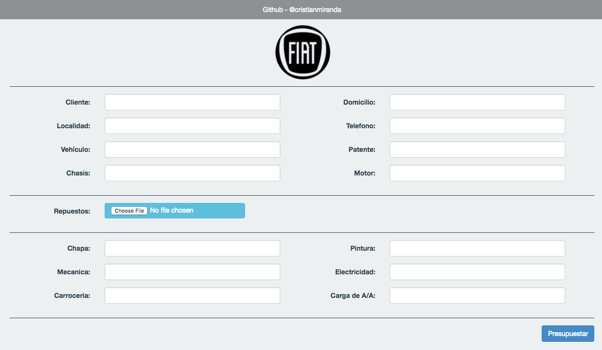

# FIAT - Presupuesto de Chapa y Pintura

## Run locally

```bash
# Install dependencies
bundle install

# Run rails server
rails server
```

## Deploy to fly.io

Dashboard: https://fly.io/apps/presupuestar

```bsah
fly deploy
```


---



---


---

Nota: Por un problema de signature al parsear el XLS, es necesario volver a guardar el mismo una vez descargado de fiatcatalogo.com.ar
